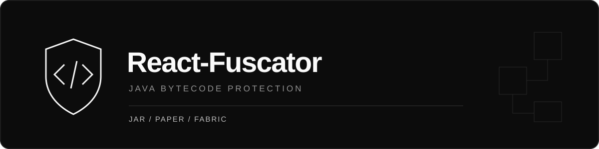
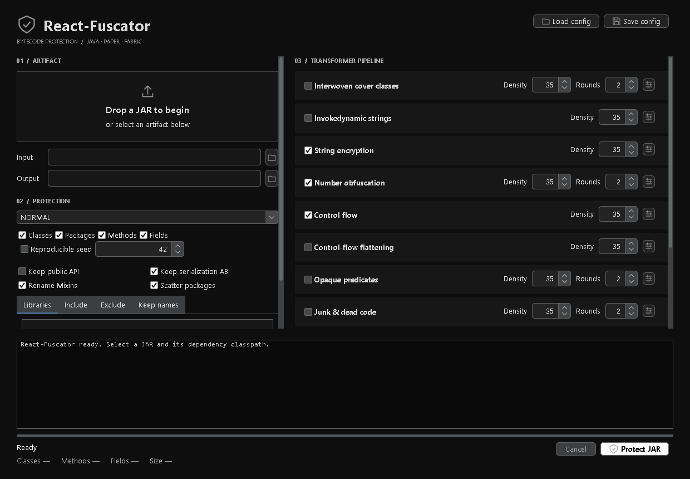

<div align="center">



**Русский** · [English](README.en.md)

[](https://github.com/jvm-argument/React-Fuscator/actions/workflows/build.yml)
[](https://github.com/jvm-argument/React-Fuscator/releases/latest)


[Скачать](https://github.com/jvm-argument/React-Fuscator/releases/latest) · [Сообщить об ошибке](https://github.com/jvm-argument/React-Fuscator/issues) · [Архитектура](docs/architecture.md)

</div>

Java + ASM обфускатор обычных JAR, Bukkit/Spigot/Paper-плагинов и Fabric-модов. GUI и CLI используют общий расширяемый pipeline, анализ совместимости и обязательную ASM verification. **Extreme выбран по умолчанию.**

## Быстрый запуск

Нужна Java 17 или новее. Скачайте `React-Fuscator.jar` из [релиза](https://github.com/jvm-argument/React-Fuscator/releases/latest):

```shell
java -jar React-Fuscator.jar gui
```

Перетащите JAR в окно, выберите output и нажмите **Obfuscate**. Для платформенного кода добавьте API и зависимости нужной версии на вкладке **Libraries**; для standalone JAR без внешних зависимостей это не требуется. Portable ZIP включает Windows-запускатель `React-Fuscator.bat`.



## CLI

```shell
java -jar React-Fuscator.jar obfuscate input.jar -o protected.jar
java -jar React-Fuscator.jar obfuscate plugin.jar -o protected.jar -l dependencies --seed 42
java -jar React-Fuscator.jar obfuscate input.jar -o protected.jar -p strong --exclude "vendor/**" --keep "api/**"
java -jar React-Fuscator.jar inspect input.jar -l dependencies
java -jar React-Fuscator.jar verify protected.jar -l dependencies
java -jar React-Fuscator.jar transformers
java -jar React-Fuscator.jar init-config config.json
java -jar React-Fuscator.jar obfuscate input.jar -o protected.jar -c config.json
java -jar React-Fuscator.jar retrace protected.jar.mapping.json stacktrace.txt
```

`-l` / `--library` принимает JAR или каталог и может повторяться. Для Fabric нужен Minecraft JAR в namespace входного мода, например intermediary, и соответствующие зависимости. Библиотеки используются для анализа и не включаются в output. Недостающая иерархия останавливает обычную обработку; `--allow-missing-dependencies` — диагностический режим с явно несертифицированным результатом.

Успешный запуск создаёт JAR, `*.mapping.json` и `*.report.json`. Mapping содержит исходные имена и нужен для retrace. JAR публикуется после проверки; фиксированный seed воспроизводит результат при неизменных входных данных, настройках и библиотеках.

## Профили и трансформеры

| Профиль | Дополнительные проходы |
|---|---|
| Light | Шифрование строк, удаление debug metadata |
| Normal | Light + числа, conditional/switch flow |
| Strong | Normal + invokedynamic/concat-строки, opaque predicates, junk code, типизированная indirection |
| **Extreme · default** | Strong + cover classes, ConstantValue, CFG flattening, exception flow, proxy и защита helpers |

Class/package/method/field remapping включён во всех профилях. Собственные virtual/interface-семейства переименовываются согласованно; внешние API callbacks сохраняют имена. Пакеты распределяются с учётом package access, nestmates и method handles.

- Несколько UTF-16 decryptors, случайное распределение, cached/interned invokedynamic strings и зашифрованные StringConcatFactory recipes.
- Числовые маски с runtime-derived значениями и сохранением IEEE-754 bits.
- Разные opaque/branch/switch шаблоны, одно- и двухуровневый CFG dispatcher, ограниченный exception-based flow.
- Типизированные bridges и multi-target dispatchers без boxing; proxy сохраняет synchronization на входном методе.
- Cover classes с реальными входящими ссылками, перемещёнными реализациями и обычными access flags.
- Удаление LocalVariableTable, LocalVariableTypeTable, LineNumberTable, MethodParameters, SourceFile и SourceDebugExtension. Семантические атрибуты сохраняются.

Настройки проходов: `--disable strings`, `--enable flatten`, `--set numbers.rounds=4`, `--set flow.density=80`. Полный список — `transformers`; конфигурации — [examples](examples).

## Совместимость и правила

Поддерживаются `plugin.yml`, `paper-plugin.yml`, `fabric.mod.json`, entrypoints, Mixins, refmap, access widener, Manifest и `META-INF/services`. Mixin-классы и пакеты меняются вместе с config/refmap; selectors и требуемые контракты сохраняются. UTF-8 resources обновляют полные class-name tokens; бинарные ресурсы и вложенные JAR сохраняются.

Reflection анализируется до rename. Named lookup сохраняет затронутых владельцев и их иерархию; неизвестные динамические lookup обрабатываются консервативно с warnings. Сохраняются JNI/JNA, enum constants, record components, serialization fields/hooks и неизвестные annotation contracts. Class identities enum/record/Serializable по умолчанию могут меняться; для старых сериализованных данных включите `preserveSerializationNames` или GUI **Keep serialization ABI**.

Правила используют JVM internal names: `com/example/**`, `com/example/Owner#method(I)V`. `include` выбирает классы, `exclude` сохраняет имена и код, `keep` сохраняет имена при включённых transforms, `keepMembers` сохраняет выбранные members. Исключённый код также получает обновлённые ссылки. Подробнее — [remapping](docs/remapping.md).

После изменения JAR старые подписи удаляются. Multi-release variants и вложенные application JAR не обфусцируются рекурсивно. Reflection из внешних данных, name-based JSON, неуказанные взаимодействующие моды/плагины и Spring Boot/WAR layouts требуют правил и отдельных runtime-проверок. Защита строк обратима во время исполнения; Extreme увеличивает размер и нагрузку на JVM.

## Leak Scanner и отчёт

После remapping и encoding сканируются constant pool, debug attributes и текстовые resources: исходные packages/classes/members, чувствительные plaintext strings, старые Paper/Fabric/Mixin references.

Находки классифицируются как `UNRESOLVED`, `RETAINED_CONTRACT`, `EXTERNAL_CONTRACT`, `AMBIGUOUS_TOKEN`, `RESOURCE_DATA` или `EXCLUDED`. Требуемые ABI-имена показываются отдельно от нерешённых утечек. Protection report содержит renamed classes/methods/fields, encrypted strings, уникальные transformed methods, removed debug attributes, predicates/proxies/dispatchers, найденные и устранённые metadata leaks, cipher/flow distributions и locations. Details ограничены 25 000 записями; полные счётчики сохраняются.

## Сборка и стиль

```powershell
mvn -B -ntp verify
./scripts/Build.ps1
./scripts/Format-Java.ps1
./scripts/Format-Java.ps1 -Check
```

Сборка требует JDK 17+, formatter — JDK 21+. Стиль основан на Google Java Format в режиме AOSP: 4 пробела, развёрнутые блоки, отдельные объявления полей, пустые строки между методами, отсутствие комментариев. CI проверяет стиль и поведение JVM на Linux/Windows с Java 17/21/25.

`ApplicationFactory` собирает зависимости через конструкторы. `core`, `analysis`, `mapping`, `remap`, `platform`, `transform`, `verification`, `io`, `cli` и `gui` разделяют ответственность. Новый проход реализует `Transformer` и регистрируется в `TransformerRegistry` или ServiceLoader. Oversized expansion откатывается для класса/прохода, ошибки verifier останавливают публикацию.

Skidfuscator использован как архитектурный референс; реализация собственная, код Skidfuscator/MapleIR не включён. Зависимости и лицензии — [THIRD-PARTY-NOTICES.md](THIRD-PARTY-NOTICES.md).

## Проверки

44 автоматических теста: исполнение до/после с `-Xverify:all`, все профили, reflection, dispatch, Unicode/NUL, числа, exceptions, synchronization, resources, metadata, воспроизводимость и публикация.

Новый Extreme проверен на реальном Xeron 1.0.0 / Fabric 1.21.4: клиент вошёл в локальный мир, 917 обычных классов прошли JVM-проверку без ошибок, Mixins и entrypoints загрузились, процесс завершился с кодом 0. Это проверка конкретного артефакта, а не всех сочетаний Minecraft/API. Предыдущая матрица Paper/Fabric 1.16.5–26.3 и ограничения — в [результатах проверок](docs/validation.md). Пользовательские моды, плагины и серверы в релиз не включаются.
